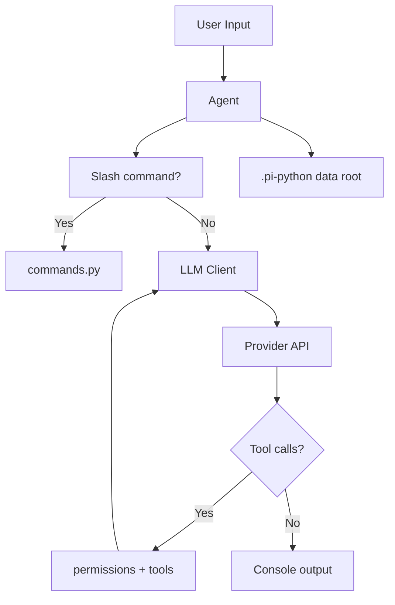

# PI - Python Agent Harness


[](https://www.python.org/downloads/)
[](https://opensource.org/licenses/MIT)

**PI** is a local CLI coding-agent harness with a Rich console UI, tool use (files, shell, search), session memory, and OpenAI-compatible LLM providers (Mistral, Groq, or custom).

## Features

- Rich console UI with markdown, history, and multiline input
- Tools: `read`, `write`, `edit`, `bash`, `grep`, `web_search`
- Providers: Mistral, Groq, or any OpenAI-compatible endpoint
- Dual API keys with automatic 429 failover
- Session persistence, resume, permissions, and slash commands
- Cross-platform (Windows, macOS, Linux)

## Installation

### Prerequisites

- Python 3.14 or higher
- pip (or uv)

### From source (development)

```bash
git clone https://github.com/your-username/pi-python.git
cd pi-python

python -m venv .venv
# Windows: .venv\Scripts\activate
source .venv/bin/activate

pip install -e .
```

Create a `.env` in the repo root for local development:

```env
ENV=development
LLM_KEY=your_api_key_here
LLM_PROVIDER=mistral
TAVILY_API_KEY=your_tavily_api_key_here
```

### As a CLI (users)

```bash
pip install .
# or from a published package once available:
# pip install pi-python

pi-python
```

Installed users do **not** need `ENV=development`. Auth and sessions go under the home data directory (see below). Use `/login`, `/provider`, and `/tavily` inside the agent to configure keys.

## Data directory (`.pi-python`)

Auth (`auth.json`) and session folders live under a single **data root**. Where that root is depends on environment:

| Mode | How | Data root |
|------|-----|-----------|
| **Development** | `ENV=development` or `ENV=dev` | `<pi-python repo>/.pi-python` (next to the package, easy to debug) |
| **Installed / production** | unset or any other value | `~/.pi-python` via `Path.home()` |

Concrete home paths:

- **Windows:** `C:\Users\<username>\.pi-python`
- **Linux:** `/home/<username>/.pi-python`
- **macOS:** `/Users/<username>/.pi-python`

The **workspace** (project the agent edits) is always the directory you launched from (`cwd`), not the data root. That way you can run `pi-python` inside any project while sessions/auth stay in the data directory.

Typical layout:

```
.pi-python/
├── auth.json                 # providers, API keys, Tavily key
├── skills/                   # global skills (optional)
└── <session-id>/
    ├── metadata.json
    └── conversation_history.jsonl
```

## Skills

Skills are markdown files the agent can load on demand for a task. They are discovered from the **project you are working in**, so an installed CLI picks up each project's own skills. Search order (first match wins):

1. `<project>/.pi-python/skills/`
2. `<project>/skills/`
3. `<data root>/skills/` — global skills (`~/.pi-python/skills`, or the repo's `.pi-python/skills` in development)

Both layouts work:

```
skills/
├── deploy/
│   └── SKILL.md      # skill named "deploy"
└── lint.md           # skill named "lint"
```

Only these directories are scanned, so stray markdown elsewhere in your project (like `README.md`) is never treated as a skill.

## Configuration

### Environment variables (mainly for development)

| Variable | Purpose |
|----------|---------|
| `ENV` / `ENVIRONMENT` | `development` or `dev` → store data in the repo; otherwise use home |
| `LLM_KEY` | Optional bootstrap API key (prefer `/login` for durable keys) |
| `LLM_PROVIDER` | e.g. `mistral`, `groq` |
| `TAVILY_API_KEY` | Optional; prefer `/tavily` |

You can also set keys interactively with `/login`, `/provider`, `/model`, and `/tavily` — they are saved in `auth.json` under the data root.

## Usage

### Start

```bash
# Development (from repo, with ENV=development)
python agent.py
# or after editable install:
pi-python

# Installed CLI (from any project directory)
cd /path/to/your/project
pi-python
```

### Natural language

```
Task > Read the contents of agent.py
Task > Create test.py with a hello world function
Task > Grep for get_data_root in this repo
Task > Search the web for latest Python 3.14 features
```

### Slash commands

| Command | Description |
|---------|-------------|
| `/help` | Show help |
| `/clear` | Clear the screen |
| `/quiet` | Collapse tool output |
| `/verbose` | Show full tool output |
| `/copy` | Copy last assistant reply |
| `/resume` | Resume a previous session |
| `/login` | Set Primary/Secondary API key |
| `/provider` | Switch provider (mistral / groq / custom) |
| `/model` | Change model for the active provider |
| `/tavily` | Set Tavily API key for `web_search` |
| `/exit` | End the session (`exit` / `quit` also work) |

### Tools

| Tool | Description |
|------|-------------|
| `read` | Read file contents |
| `write` | Create or overwrite files |
| `edit` | Precise text edits |
| `bash` | Run shell commands |
| `grep` | Search files (cross-platform) |
| `web_search` | Web search via Tavily |

## Project structure

```
pi-python/
├── agent.py           # Entry point / main loop
├── commands.py        # Slash commands
├── config.py          # Auth + provider settings
├── console.py         # Rich console UI
├── interrupt.py       # ESC interrupt handling
├── llm.py             # LLM client + tool loop
├── memory.py          # Sessions + data root
├── models.py          # Message / Session models
├── permissions.py     # Tool permission prompts
├── skills.py          # Skills loader
├── tools.py           # Tool implementations
├── prompts/
│   └── SYSTEM.md      # System prompt
├── pyproject.toml
├── .env               # Local env (gitignored; set ENV=development)
└── .pi-python/        # Dev data root (gitignored)
```

## Architecture (high level)



## Troubleshooting

1. **API key missing** — Run `/login`, or set `LLM_KEY` in `.env` for local bootstrap.
2. **Sessions / auth not where you expect** — Check `ENV`. Development uses the repo `.pi-python`; installed use uses `~/.pi-python`.
3. **`pi-python` not found** — Ensure the Scripts directory is on your PATH (e.g. `%APPDATA%\Python\Python314\Scripts` on Windows), or reinstall with `pip install -e .`.
4. **Web search fails** — Set a key with `/tavily` or `TAVILY_API_KEY`.

## Contributing

1. Fork the repository
2. Create a feature branch (`git checkout -b feature/amazing-feature`)
3. Commit your changes
4. Open a Pull Request

```bash
pip install -e .
# Optional: set ENV=development in .env so data stays in the repo
```

## License

MIT — see [LICENSE](LICENSE).

## Acknowledgments

- [Mistral AI](https://mistral.ai/), [Groq](https://groq.com/), and other OpenAI-compatible providers
- [Rich](https://github.com/Textualize/rich) and [Prompt Toolkit](https://github.com/prompt-toolkit/python-prompt-toolkit)
- [Tavily](https://tavily.com/) for web search

---

**PI - Python Agent Harness** © 2026
