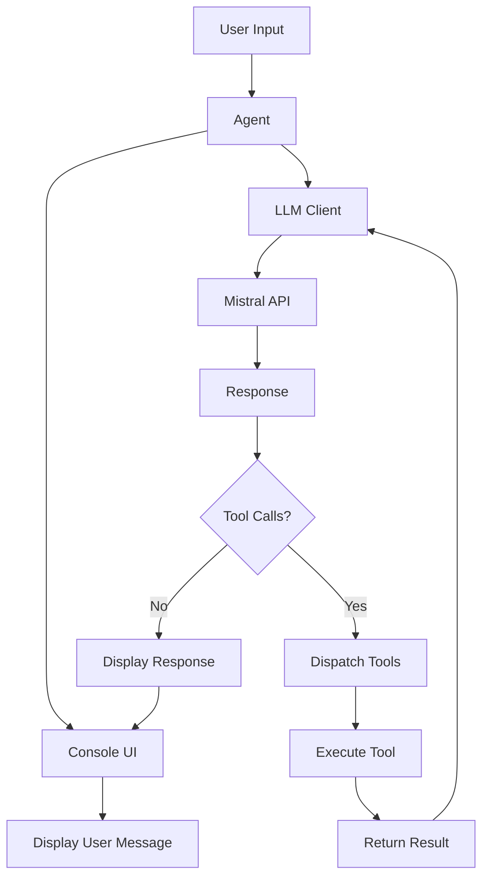

# PI - Python Agent Harness


[](https://www.python.org/downloads/)
[](https://opensource.org/licenses/MIT)

**PI** is a powerful Python-based coding agent harness that provides an enhanced console interface for interacting with Mistral AI models. It's designed to help developers with coding tasks through natural language commands, with built-in tools for file operations, code execution, and system commands.

## 🚀 Features

- **Enhanced Console UI**: Rich formatting with colors, panels, and markdown support
- **Command History**: Persistent command history with auto-suggest functionality
- **Tool Integration**: Built-in tools for file operations (read, write, edit) and bash commands
- **Mistral AI Integration**: Seamless integration with Mistral's chat and embedding models
- **Loading Indicators**: Visual feedback during processing
- **Error Handling**: Graceful error handling with styled error messages
- **Code Syntax Highlighting**: Automatic syntax highlighting for code blocks
- **Cross-Platform**: Works on Windows, macOS, and Linux

## 📦 Installation

### Prerequisites

- Python 3.14 or higher
- pip or uv package manager

### Quick Install

```bash
# Clone the repository
git clone https://github.com/your-username/pi-python.git
cd pi-python

# Create virtual environment (optional but recommended)
python -m venv .venv
source .venv/bin/activate  # On Windows: .venv\Scripts\activate

# Install dependencies
pip install -r pyproject.toml
```

### Using UV (Recommended)

```bash
# Install using uv
uv pip install -r pyproject.toml
```

## 🛠️ Configuration

### Environment Variables

Create a `.env` file in the project root:

```env
LLM_KEY=your_mistral_api_key_here
```

You can obtain a Mistral API key from [Mistral AI](https://mistral.ai/).

### Project Structure

```
pi-python/
├── agent.py           # Main agent logic
├── console.py         # Enhanced console UI
├── llm.py             # LLM integration
├── models.py          # Data models and enums
├── tools.py           # Tool implementations
├── prompts/
│   ├── __init__.py    # Prompt management
│   └── SYSTEM.md      # System prompt
├── memory/            # Conversation memory (future)
├── pyproject.toml     # Project configuration
├── .env               # Environment variables
└── README.md           # This file
```

## 🏃 Usage

### Starting the Agent

```bash
# Run the agent
python agent.py
```

### Basic Commands

Once the agent is running, you can interact with it using natural language:

```
Task > Read the contents of agent.py
Task > Create a new Python file called test.py with a hello world function
Task > Edit test.py to add error handling
Task > Run a bash command to list files
Task > exit  # or quit to end session
```

### Available Tools

The agent has access to the following tools:

| Tool | Description | Example Usage |
|------|-------------|---------------|
| `read` | Read file contents | `read(path="agent.py")` |
| `write` | Create/overwrite files | `write(path="test.py", content="print('hello')")` |
| `edit` | Edit files precisely | `edit(path="test.py", edits=[{"oldText": "print('hello')", "newText": "print('world')"}])` |
| `bash` | Execute shell commands | `bash(command="ls -la")` |

### Console Features

- **Tab Completion**: Auto-complete common commands
- **Command History**: Use up/down arrows to navigate previous commands
- **Auto-Suggest**: Suggestions based on command history
- **Syntax Highlighting**: Code blocks are automatically syntax highlighted
- **Markdown Support**: Responses are rendered as markdown when possible

## 🔧 Architecture

### Core Components

1. **Agent (agent.py)**
   - Main entry point
   - Manages conversation state
   - Handles tool calls and responses

2. **Console UI (console.py)**
   - Rich console interface using `rich` library
   - Command history with `prompt_toolkit`
   - Loading indicators and progress feedback

3. **LLM Integration (llm.py)**
   - Mistral AI client integration
   - Message management
   - Tool call dispatching

4. **Tools (tools.py)**
   - File operations (read, write, edit)
   - Bash command execution
   - Tool call dispatching

5. **Models (models.py)**
   - Data models for messages
   - Role enums (USER, SYSTEM, TOOL)
   - Model configurations

6. **Prompts (prompts/)**
   - System prompt management
   - User prompt generation
   - XML-based prompt structuring

### Workflow



## 📝 Prompt Engineering

The system prompt is defined in `prompts/SYSTEM.md`. You can customize it to change the agent's behavior.

### Default System Prompt

The agent uses a system prompt that instructs it to:
- Act as an expert coding assistant
- Use available tools for file operations
- Provide clear, concise responses
- Handle errors gracefully

### Customizing Prompts

Edit `prompts/SYSTEM.md` to modify the agent's behavior. The prompt uses XML structure for better parsing.

## 🔌 Extending the Agent

### Adding New Tools

To add a new tool:

1. Add the tool function in `tools.py`:

```python
def execute_new_tool(param1: str, param2: int) -> str:
    """Description of the new tool."""
    # Implementation here
    return result
```

2. Add the tool to the `TOOLS` list in `tools.py`:

```python
TOOLS.append({
    "type": "function",
    "function": {
        "name": "new_tool",
        "description": "Description of the new tool",
        "parameters": {
            "type": "object",
            "properties": {
                "param1": {"type": "string", "description": "First parameter"},
                "param2": {"type": "integer", "description": "Second parameter"}
            },
            "required": ["param1", "param2"]
        }
    }
})
```

3. Add the dispatch logic in `dispatch_tool_call`:

```python
elif tool_name == "new_tool":
    args = json.loads(function_arguments)
    return execute_new_tool(args["param1"], args["param2"])
```

### Custom Models

Edit `models.py` to add new model configurations:

```python
class Models(Enum):
    EMBEED = "mistral-embed"
    CHAT = "mistral-medium-latest"
    NEW_MODEL = "your-model-name"
```

## 🎨 Customization

### Console Theme

Modify the color schemes in `console.py`:

```python
# Change panel colors
self.console.print(
    Panel(
        Text(message, style="white"),
        title=title,
        border_style="cyan",  # Change from blue to cyan
        box=box.DOUBLE
    )
)
```

### Loading Indicators

Change the spinner style in `console.py`:

```python
@contextmanager
def print_loading(self, message: str = "Thinking..."):
    with Live(Spinner("moon", text=message), console=self.console) as live:
        yield live
```

Available spinners: `dots`, `moon`, `line`, `pipe`, `simple`, `aesthetic`

## 🐛 Troubleshooting

### Common Issues

1. **API Key Not Found**
   - Ensure `.env` file exists with `LLM_KEY` variable
   - Check that the file is in the project root

2. **Module Not Found**
   - Run `pip install -r pyproject.toml` to install dependencies
   - Activate your virtual environment

3. **Command History Not Working**
   - Ensure `.pi_history` file exists and is writable
   - Check file permissions

4. **Syntax Highlighting Not Working**
   - Ensure `rich` and `pygments` are installed
   - Try specifying the language explicitly

### Debug Mode

Enable debug mode by modifying `agent.py`:

```python
from rich.traceback import install
install(show_locals=True)  # Shows local variables in tracebacks
```

## 📊 Performance Tips

- **Token Usage**: Monitor your Mistral API token usage
- **Caching**: Consider caching frequent file reads
- **Timeout**: Adjust bash command timeout in `tools.py` (default: 120 seconds)

## 🤝 Contributing

1. Fork the repository
2. Create a feature branch (`git checkout -b feature/amazing-feature`)
3. Commit your changes (`git commit -m 'Add amazing feature'`)
4. Push to the branch (`git push origin feature/amazing-feature`)
5. Open a Pull Request

### Development Setup

```bash
# Install development dependencies
pip install -e .[dev]

# Run tests (if available)
pytest

# Run linting
ruff check .
```

## 📜 License

This project is licensed under the MIT License - see the [LICENSE](LICENSE) file for details.

## 🙏 Acknowledgments

- [Mistral AI](https://mistral.ai/) for the powerful language models
- [Rich](https://github.com/Textualize/rich) for the beautiful console output
- [Prompt Toolkit](https://github.com/prompt-toolkit/python-prompt-toolkit) for the enhanced input experience
- All contributors and users of this project

## 📞 Support

- **Issues**: Open an issue on GitHub
- **Discussions**: Join the discussions on GitHub
- **Email**: contact@example.com (replace with your email)

---

**PI - Python Agent Harness** © 2026

*Built with ❤️ and Python*
